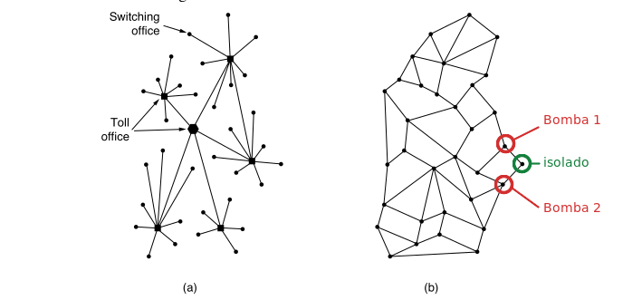

# Exercício 1.30

## Enunciado

A sub-rede da Figura 1-12(b) foi projetada para resistir a uma guerra nuclear. Quantas bombas seriam necessárias para dividir seus nós em dois conjuntos desconectados? Suponha que cada bomba destrua um nó e todos os enlaces conectados a ele.

---

## Resolução — @Pins

A extremidade direita da figura, existe um nó ligado ao restante da rede por apenas dois nós vizinhos. Se esses dois vizinhos forem destruídos, esse nó continuará existindo, mas ficará isolado do restante da rede.

Portanto:

$$
\boxed{2\text{ bombas}}
$$

**Confiança:** alta  
**Referência:** subcapítulo 1.4.1 - ARPANET

---

## Resolução — @outro-usuario

_(uma segunda resolução vai aqui embaixo, não substitua a de cima)_

---

## Discussão

_(divergências entre as resoluções, o que ficou em aberto)_
