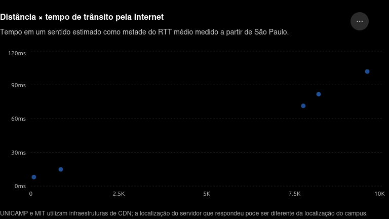

# Exercício 1.45

## Enunciado

O programa ping permite enviar um pacote de teste para determinado destino e verificar quanto tempo ele leva para ir até lá e voltar. Utilize o ping para medir quanto tempo o pacote leva para viajar da sua localização até vários destinos conhecidos.

Com esses dados, construa um gráfico do tempo de trânsito em um único sentido pela Internet em função da distância. É recomendável utilizar universidades, pois a localização de seus servidores é conhecida com bastante precisão.

Por exemplo:

- berkeley.edu está em Berkeley, Califórnia;
- mit.edu está em Cambridge, Massachusetts;
- vu.nl está em Amsterdã, Países Baixos;
- www.usyd.edu.au está em Sydney, Austrália;
- www.uct.ac.za está na Cidade do Cabo, África do Sul.

---

## Resolução — @Pins

Para estimar o tempo de trânsito em apenas um sentido, dividimos o tempo médio de ida e volta, ou RTT, por dois:

$$
t_{\text{ida}} \approx \frac{\text{RTT médio}}{2}
$$

A distância considerada é a distância geodésica aproximada entre São Paulo e a cidade onde se localiza cada universidade.

| Universidade              | Localização            | Distância |  RTT médio | Tempo de ida estimado |
| ------------------------- | ---------------------- | --------: | ---------: | --------------------: |
| UNICAMP                   | Campinas, Brasil       |     84 km |  16,018 ms |              8,009 ms |
| UFRGS                     | Porto Alegre, Brasil   |    852 km |  29,752 ms |             14,876 ms |
| MIT                       | Cambridge, EUA         |  7.749 km | 142,749 ms |             71,375 ms |
| Universidade de Toronto   | Toronto, Canadá        |  8.186 km | 163,566 ms |             81,783 ms |
| Universidade de Cambridge | Cambridge, Reino Unido |  9.567 km | 203,863 ms |            101,932 ms |

Os resultados mostram uma tendência de crescimento do tempo de trânsito à medida que a distância aumenta. Entretanto, essa relação não é perfeitamente linear, pois os pacotes não percorrem necessariamente a menor distância geográfica. O atraso também depende das rotas escolhidas, da quantidade de roteadores, do congestionamento, das filas e das tecnologias utilizadas nos enlaces.

Além disso, os resultados indicam que `www.unicamp.br` respondeu por meio da infraestrutura da Amazon CloudFront e que `mit.edu` respondeu por meio da Akamai. Portanto, esses pacotes podem ter alcançado servidores intermediários localizados fora dos campi. Nesses dois casos, a distância geográfica até a universidade pode não representar a distância efetivamente percorrida pelo pacote.

Todos os testes entregaram os dez pacotes enviados, sem perda de pacotes.

**Confiança:** alta  
**Referência:** seção NA

---

## Resolução — @outro-usuario

_(uma segunda resolução vai aqui embaixo, não substitua a de cima)_

---

## Discussão

_(divergências entre as resoluções, o que ficou em aberto)_
