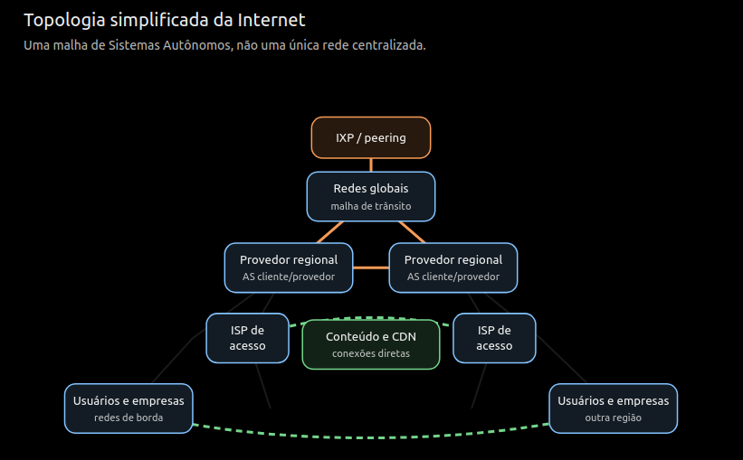

# Exercício 1.48

## Enunciado

A Internet é formada por um grande número de redes. A maneira como essas redes estão organizadas determina a topologia da Internet. Uma quantidade considerável de informações sobre essa topologia está disponível on-line.

Utilize um mecanismo de busca para conhecer melhor a topologia da Internet e escreva um breve relatório resumindo suas descobertas.

---

## Resolução — @Pins

# Topologia da Internet

A Internet não é uma única rede administrada por uma organização central. Ela é uma **rede de redes**, formada pela interconexão de milhares de redes independentes pertencentes a provedores de acesso, operadoras de telecomunicações, universidades, empresas, governos e provedores de conteúdo.

Sua topologia pode ser estudada em diferentes níveis. No nível físico, ela é composta por roteadores, fibras ópticas, cabos submarinos, enlaces de rádio e satélites. No nível lógico, é mais comum representá-la como um grafo de **Sistemas Autônomos**, ou ASes. Um Sistema Autônomo é um conjunto de redes administradas por uma mesma organização e que possui uma política de roteamento própria. Cada AS é identificado por um número chamado ASN.

As informações de roteamento são trocadas entre os Sistemas Autônomos por meio do **Border Gateway Protocol (BGP)**. Em vez de escolher necessariamente o caminho geograficamente mais curto, o BGP seleciona rotas de acordo com as políticas definidas pelos operadores das redes. Essas políticas consideram aspectos técnicos, econômicos e comerciais. Por isso, dois locais fisicamente próximos podem trocar dados por uma rota relativamente longa. O BGP é o protocolo utilizado para distribuir informações de alcance entre os Sistemas Autônomos que compõem a Internet. [RFC 4271 — Border Gateway Protocol](https://www.rfc-editor.org/rfc/rfc4271.html)

As interconexões entre ASes geralmente seguem dois modelos principais. Na relação **cliente–provedor**, uma rede paga a outra para alcançar o restante da Internet; esse serviço é chamado de trânsito. No **peering**, duas redes trocam diretamente o tráfego destinado aos seus próprios clientes, normalmente para reduzir custos e melhorar o desempenho. A [CAIDA](https://www.caida.org/) também identifica relações entre redes pertencentes à mesma organização. Essas relações comerciais influenciam diretamente os caminhos pelos quais os pacotes podem circular. [CAIDA AS Rank — relações entre Sistemas Autônomos](https://asrank.caida.org/about)

Os **Internet Exchange Points (IXPs)**, ou Pontos de Troca de Tráfego, são locais nos quais várias redes podem estabelecer conexões diretas. Eles evitam que parte do tráfego precise passar por provedores intermediários, diminuindo custos, distância percorrida e latência. Redes de distribuição de conteúdo, chamadas **CDNs**, também posicionam servidores próximos aos usuários e conectam-se diretamente a provedores de acesso. Isso explica por que um domínio pertencente a uma organização distante pode responder por meio de um servidor localizado na mesma região do usuário. [Internet Society — Internet Exchange Points](https://www.internetsociety.org/issues/ixps/)

Historicamente, a Internet era descrita como uma estrutura aproximadamente hierárquica: redes de acesso ligavam-se a provedores regionais, que compravam trânsito de grandes redes globais. Essa descrição ainda é útil, mas tornou-se incompleta. Atualmente, IXPs, CDNs, serviços de nuvem e conexões privadas criam numerosos atalhos e transformam a topologia em uma malha mais densa. No topo da hierarquia tradicional encontram-se redes de grande alcance que não compram trânsito, mas trocam tráfego entre si por meio de peering.

Não existe, entretanto, um mapa inteiramente completo e preciso da Internet. Muitas conexões e acordos comerciais são privados. Pesquisadores inferem sua topologia analisando anúncios BGP e medições realizadas com ferramentas como `traceroute`. A CAIDA mantém projetos que produzem mapas nos níveis de endereço IP, roteador e Sistema Autônomo, mas ressalta que as relações reais precisam ser inferidas a partir de dados observados em diferentes pontos da rede.

Conclui-se que a topologia da Internet é descentralizada, dinâmica e parcialmente hierárquica. Essa estrutura oferece redundância e permite que o tráfego encontre rotas alternativas quando ocorrem falhas. Ao mesmo tempo, ela torna o comportamento da Internet dependente de políticas comerciais, da concentração de grandes provedores e da disponibilidade de pontos de interconexão.

**Confiança:** alta  
**Referência:** seção NA

---

## Resolução — @outro-usuario

_(uma segunda resolução vai aqui embaixo, não substitua a de cima)_

---

## Discussão

_(divergências entre as resoluções, o que ficou em aberto)_
