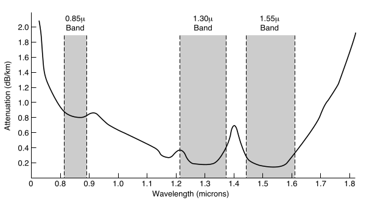

# Exercício 2.5

## Enunciado

Na Fig. 2-5, a faixa localizada à esquerda é mais estreita que as demais. Por quê?

---

## Resolução — @Pins

Vimos no exercício 3 que para uma pequena variação no comprimento de onda, temos:

$$\Delta f \approx \frac{c\,\Delta\lambda}{\lambda^2}$$

ou

$$\Delta \lambda \approx \frac{\lambda^2}{c}\Delta f$$

Assim a faixa da esquerda parece mais estreita porque a figura utiliza o comprimento de onda no eixo horizontal. Embora as três faixas tenham aproximadamente a mesma largura em frequência, a faixa de $0{,}85\mu\text{m}$ aparece mais estreita porque uma determinada variação de frequência corresponde a um intervalo menor de comprimentos de onda quando $\lambda$ é menor.

**Confiança:** alta  
**Referência:** subcapítulo 2.1.5 - fibras óticas

---

## Resolução — @outro-usuario

_(uma segunda resolução vai aqui embaixo, não substitua a de cima)_

---

## Discussão

_(divergências entre as resoluções, o que ficou em aberto)_
